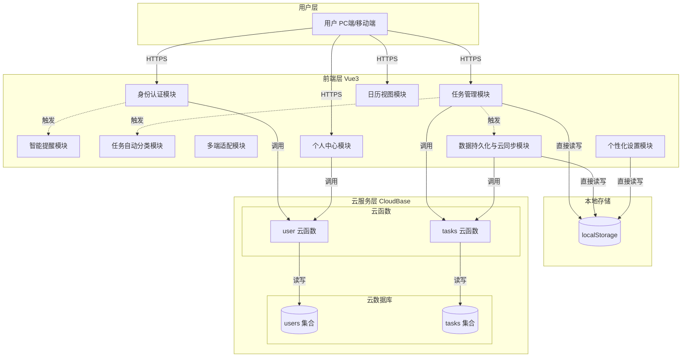
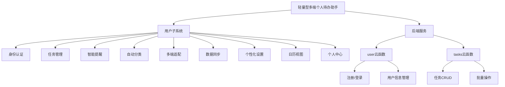
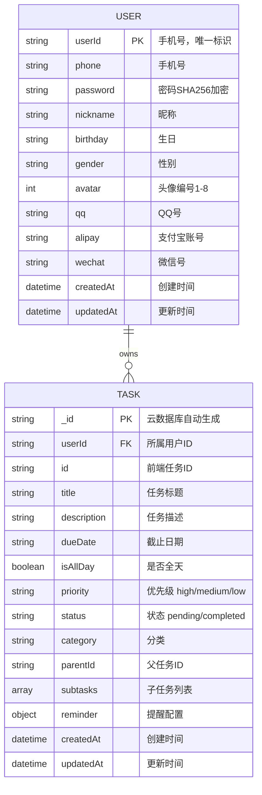
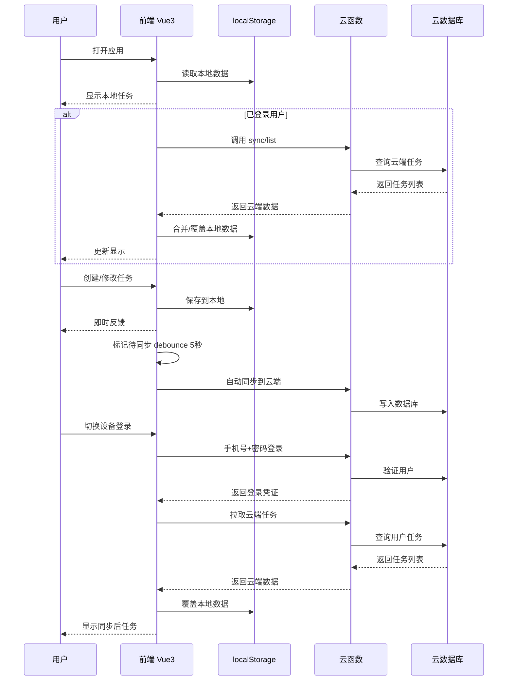
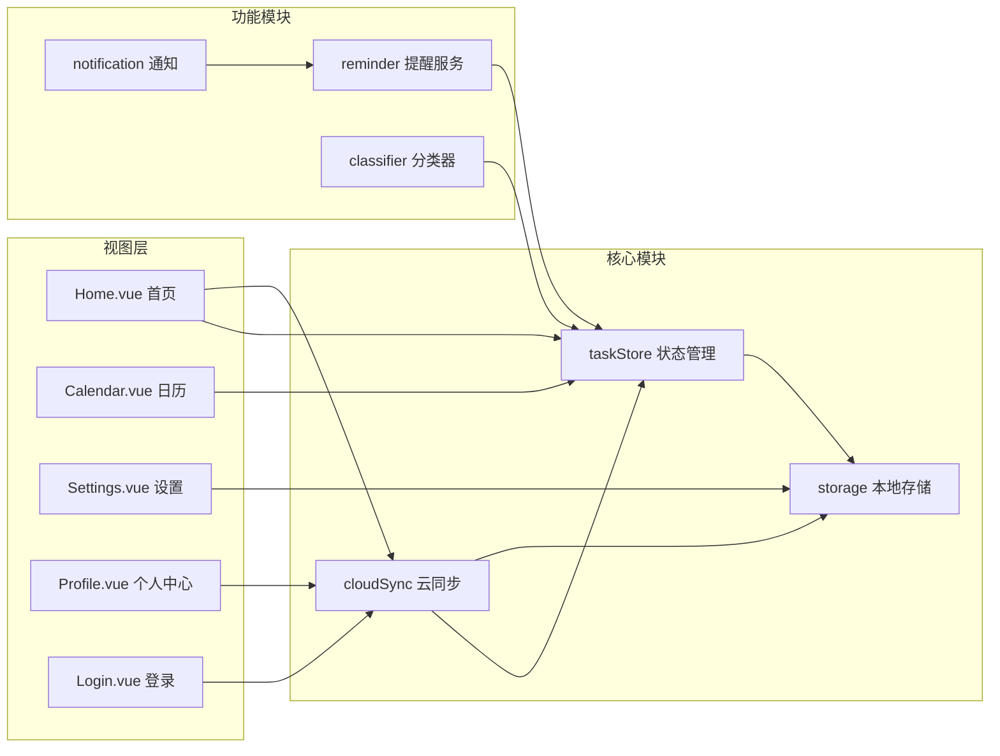
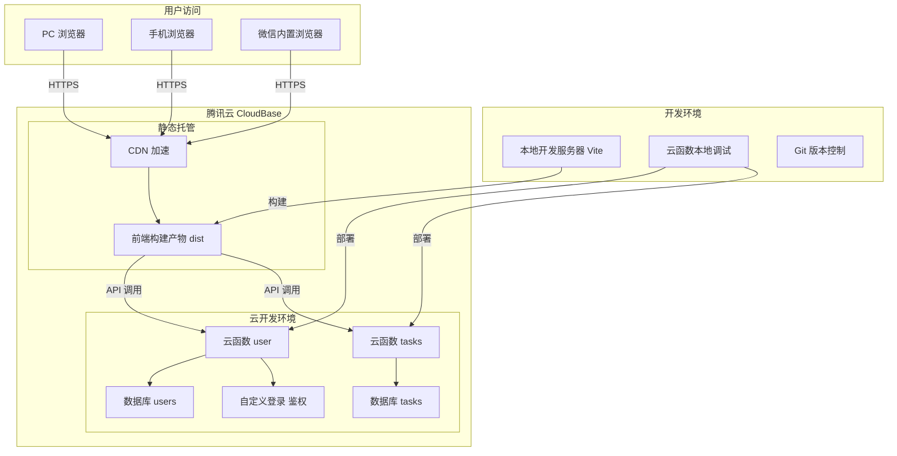

# 轻量型多端个人待办助手 - 系统架构图

## 1. 系统总体架构图

## 2. 功能结构图（简约版）

## 3. 实体关系图（ER图）

### 实体说明

| 实体 | 说明 | 主键 |
|------|------|------|
| USER | 用户实体，手机号作为唯一标识 | userId |
| TASK | 任务实体，属于某个用户 | _id（云数据库生成） |

### 关系说明

| 关系 | 类型 | 说明 |
|------|------|------|
| USER owns TASK | 一对多 | 一个用户可拥有多个任务，每个任务只属于一个用户 |

## 3. 数据流向图

## 4. 模块依赖关系图

## 5. 部署架构图

---

## 使用说明

1. **查看架构图**：将上述 Mermaid 代码复制到以下工具查看：
   - [Mermaid Live Editor](https://mermaid.live/)
   - VS Code + Mermaid 插件
   - GitHub/GitLab Markdown 预览

2. **导出图片**：在 Mermaid Live Editor 中可导出 PNG/SVG/PDF 格式

3. **修改维护**：如需调整架构，直接编辑本文档中的 Mermaid 代码
